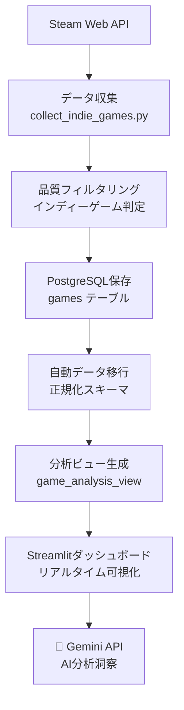

# Steam Indie Analytics - データエンジニア転職ポートフォリオ

[](https://www.python.org/)
[](https://www.postgresql.org/)
[](https://www.docker.com/)
[](https://streamlit.io/)

## 🎯 プロジェクト概要

Steam APIを活用してインディーゲーム市場の分析を行い、データエンジニアリング・データ分析のスキルセットを実証するポートフォリオプロジェクト。AIを活用した分析レポート生成まで、現代的なデータ分析ワークフローを一貫して実装。

### ✨ 主な特徴

- 🤖 **AI分析洞察**: Gemini APIによる自動分析コメント生成
- 🔄 **完全自動化**: データ収集→移行→ダッシュボード反映まで1コマンド
- 📊 **インタラクティブダッシュボード**: 548件のインディーゲームデータを可視化
- 🏗️ **スケーラブル設計**: 正規化されたデータベーススキーマ
- 🐳 **コンテナ化**: Docker Composeによる完全な開発環境

## 📊 ライブデモ

### ダッシュボード
- **URL**: http://localhost:8501
- **データ**: 548件のインディーゲーム分析
- **AI洞察**: 4セクションでAI分析コメント生成

### 分析ノートブック  
- **Jupyter Lab**: http://localhost:8889 (token: steam_analytics)
- **pgAdmin**: http://localhost:8081 (admin@steam-analytics.local / admin123)

## 🛠️ 技術スタック

### Core Technologies
```yaml
Language: Python 3.11
Database: PostgreSQL 15+
Container: Docker & Docker Compose
Environment: Windows 11 + WSL2 + Dev Container
```

### Data Engineering Stack
```yaml
Data Collection:
  - Steam Web API (認証不要)
  - aiohttp (非同期HTTP)
  - tenacity (自動リトライ)

Data Processing:
  - pandas (データ変換)
  - SQLAlchemy 2.0 (ORM)
  - pydantic (バリデーション)
  - 正規化データベース設計

Infrastructure:
  - PostgreSQL (データウェアハウス)
  - Redis (キャッシュ)
  - 自動データ移行システム
```

### Analytics & AI Stack
```yaml
Analysis:
  - NumPy, SciPy (数値計算・統計)
  - Jupyter Lab (探索的分析)

Visualization:
  - Streamlit (ダッシュボード)
  - Plotly (インタラクティブグラフ)

AI Integration:
  - Google Gemini API (分析洞察生成)
  - コスト効率的な実装 (無料枠活用)
```

## 🚀 クイックスタート

### 1. 環境準備
```bash
# Dev Container内で実行
docker-compose --profile dev up -d
```

### 2. APIキー設定
```bash
cp .env.example .env
# .envファイルでAPIキーを設定:
# STEAM_API_KEY=your_steam_api_key_here
# GEMINI_API_KEY=your_gemini_api_key_here
```

### 3. データ収集 (自動化済み)
```bash
# Steam APIからデータ収集 + 自動データ移行
python collect_indie_games.py
```

### 4. ダッシュボード起動
```bash
streamlit run src/dashboard/app.py
# → http://localhost:8501 でアクセス
```

## 📈 実装済み分析機能

### 🔍 市場概要分析
- **総ゲーム数**: 548件のインディーゲーム
- **価格分析**: 無料〜プレミアム価格帯の分布
- **レビュー分析**: ユーザー評価トレンド
- **🤖 AI洞察**: 市場動向の自動分析コメント

### 🎮 ジャンル別分析
- **主要ジャンル**: Action(248件), Adventure(114件), Casual(95件)
- **複数ジャンル対応**: 1ゲーム→複数ジャンル分類
- **成功率分析**: ジャンル別パフォーマンス比較
- **🤖 AI洞察**: 競争状況と開発者向けアドバイス

### 💰 価格戦略分析
- **価格帯分布**: 無料〜プレミアム(¥4,500+)の詳細分析
- **価格vs評価**: 相関分析とインタラクティブ可視化
- **競合比較**: 価格帯別の市場ポジショニング
- **🤖 AI洞察**: 最適価格戦略の提案

### 💡 戦略的洞察
- **成功要因**: 高評価ゲームの特徴抽出
- **市場機会**: ニッチ分野の発見
- **推奨事項**: 新規参入者向けガイダンス
- **🤖 AI洞察**: 包括的戦略アドバイス

## 🔄 データフロー



## 🏗️ データベース設計

### 正規化スキーマ (実装済み)
```sql
-- 主要テーブル
games_normalized     -- ゲーム基本情報
genres              -- ジャンルマスタ  
developers          -- 開発者マスタ
publishers          -- パブリッシャーマスタ

-- 中間テーブル
game_genres         -- ゲーム-ジャンル関係
game_developers     -- ゲーム-開発者関係
game_publishers     -- ゲーム-パブリッシャー関係

-- 分析ビュー
game_analysis_view  -- ダッシュボード用統合ビュー
```

## 🎯 転職アピールポイント

### 📊 データエンジニアリング実践力
✅ **本格的なETLパイプライン**: Steam API → PostgreSQL  
✅ **データ品質管理**: 厳格なフィルタリング・バリデーション  
✅ **スケーラブル設計**: 正規化データベース・ビュー活用  
✅ **自動化**: 収集→移行→反映の完全自動化  

### 🤖 AI・機械学習統合
✅ **LLM API統合**: Gemini APIによる自然言語分析  
✅ **コスト意識**: 無料枠活用による効率的実装  
✅ **実用的AI活用**: データ分析業務の自動化  

### 💼 ビジネス価値創出
✅ **市場インサイト**: インディーゲーム市場の数値化  
✅ **意思決定支援**: 開発者向け戦略的アドバイス  
✅ **ROI最大化**: データドリブンな投資判断支援  

### 🚀 技術・学習力
✅ **短期習得**: 11日間での包括的システム構築  
✅ **現代的開発**: Claude Code活用による効率化  
✅ **問題解決**: 自律的なトラブルシューティング  

## 📁 プロジェクト構造

```
steam-indie-analytics/
├── 📊 src/
│   ├── analyzers/          # 分析ロジック + AI洞察
│   │   ├── ai_insights_generator.py  # 🤖 Gemini API統合
│   │   ├── market_analyzer.py
│   │   └── success_analyzer.py
│   ├── collectors/         # データ収集
│   ├── dashboard/          # Streamlit UI
│   └── models/             # データモデル
├── 🔧 scripts/
│   ├── migrate_to_normalized_schema.py  # 自動データ移行
│   └── setup_database.py
├── 📈 notebooks/          # Jupyter分析ノートブック
├── 🧪 tests/              # テストコード
├── 🐳 Docker環境
│   ├── docker-compose.yml
│   └── .devcontainer/
└── 📚 ドキュメント
    ├── CLAUDE.md          # 開発仕様書
    └── README.md          # 本ファイル
```

## 🔧 開発コマンド

### データ収集・移行
```bash
# 完全自動化 (推奨)
python collect_indie_games.py

# 手動ステップ実行
python scripts/run_etl.py
python scripts/migrate_to_normalized_schema.py
```

### 開発・テスト
```bash
# ダッシュボード起動
streamlit run src/dashboard/app.py

# データベース接続テスト  
python tests/test_db_connection.py

# AI機能テスト
python src/analyzers/ai_insights_generator.py

# コード品質チェック
black src/ tests/ && isort src/ tests/ && flake8 src/ tests/
```

## 📊 現在のデータ状況

- **総ゲーム数**: 1,094件 (Steam APIから収集)
- **インディーゲーム**: 548件 (品質フィルタ適用後)
- **価格情報**: 421件 (77%のカバレッジ)
- **レビューデータ**: 394件 (詳細分析対象)
- **ジャンル分布**: Action, Adventure, Casual が主要

## 🎯 今後の拡張計画

1. **📊 分析機能拡張**
   - 時系列トレンド分析
   - 競合ゲーム推薦システム
   - 売上予測モデル

2. **🤖 AI機能強化**  
   - より詳細な自然言語レポート
   - 画像解析 (ゲームスクリーンショット)
   - 感情分析 (レビューテキスト)

3. **🚀 デプロイ・運用**
   - クラウドデプロイ (AWS/GCP)
   - CI/CD パイプライン
   - 監視・アラート機能

## 📞 お問い合わせ

このポートフォリオに関するご質問やフィードバックがございましたら、お気軽にお声がけください。

---

**🤖 このプロジェクトは Claude Code を活用して効率的に開発されました。**

📅 **最終更新**: 2025年6月23日  
📊 **データ規模**: 548件のインディーゲーム分析  
🔥 **主要機能**: AI洞察生成、自動データ収集・移行、インタラクティブダッシュボード  
⚡ **開発期間**: 11日間 (2025年6月12日〜6月23日)  